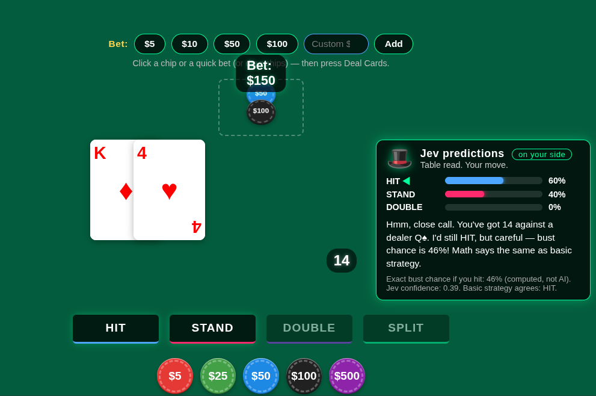

# Gambler Jev — Blackjack with an AI in your corner



A localhost blackjack website where **Gambler Jev** sits next to you and reads
the table before every move. The dealer is the opponent; Jev is on your side —
pop up the **Jev predictions** panel next to your cards and you get HIT / STAND /
DOUBLE percentages, the exact bust chance, and a straight-talking recommendation.

## Run it

```bash
pip install -r requirements.txt
cp .env.example .env   # put your real TYPESAFE_API_KEY in .env
python app.py
```

Open http://127.0.0.1:5000 (localhost only).

Get a key at https://console.typesafe.ai/keys. Without a key the game still
works — Jev shows an honest math fallback (exact bust chance + basic strategy)
instead of live percentages.

## How it plays

1. Place a bet: click a **$5 / $10 / $50 / $100** quick-bet button, type a
   custom amount, or click/drag chips — then press **Deal Cards**.
2. After the deal, and after every **Hit**, the buttons lock while Jev reads
   the table. The **Jev predictions** bubble pops up next to your cards with
   per-action percentages and a message, then the buttons unlock.
3. Press **Stand** or **Double**: the dealer reveals and draws to 17.
   Jev hides until your next decision.

## Under the hood

- `app.py` — Flask server (`/`, `/api/health`, `/api/jev-advice`), bound to
  `127.0.0.1` so the API key never leaves your machine.
- `jev.py` — blackjack math in code (totals, exact bust chance, basic
  strategy) + a TypeSafe `jev-latest` call (`Choice` over hit/stand/double
  plus a `Noul` on whether to hit). Code owns the workflow; Jev supplies
  the judgment.
- `static/index.html` — game table skin (upstream: Saganaki22/Blackjack,
  Apache-2.0, see `LICENSE.Saganaki22`) + Jev predictions panel + quick bet.
- `favicon/` — upstream icons so the browser stops 404-ing.

## Security

`.env` is gitignored — never commit it. If a key ever leaks (chat,
screenshot, repo), rotate it at https://console.typesafe.ai/keys.
